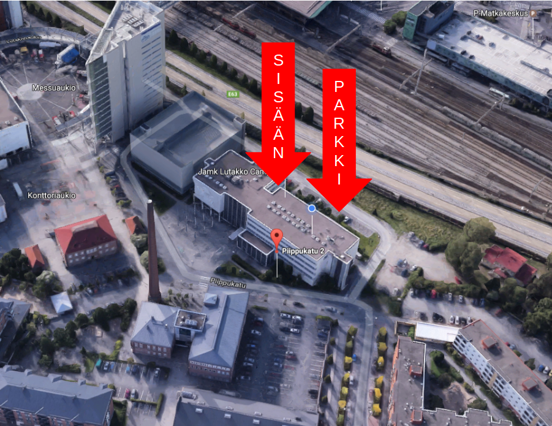

## Tervetuloa WIMMA Labin (aka Challenge Factory) avoimien ovien tapahtumaan!

Olemme käynnistäneet JAMKin IT-instituutissa jo seitsemättä kertaa "Challenge Factory" opiskelijaprojektin kesän ajaksi.  
Tänä vuonna projekti vaihtaa nimeään ja uusi nimi on __WIMMA Lab__.

Tervetuloa tutustumaan mitä tänä vuonna työstetään!

* Perjantaina 9.6.2017 alkaen klo 9:45 - 11:30
* Piippukatu 2, 4. krs luokkaan D404-405
* Kannattaa ilmoittautua ennakkoon [Doodle-palvelun avulla](https://doodle.com/poll/rc8r9cvyr2dv4rzt)! Saatat saada kahvia ja pullaa
* [Google Map](https://www.google.fi/maps/place/Jyv%C3%A4skyl%C3%A4n+Ammattikorkeakoulu+Oy/@62.2416303,25.7598717,18.75z/data=!4m5!3m4!1s0x0000000000000000:0x75aa55a81cd7c009!8m2!3d62.2416224!4d25.7597309?hl=en)

_360 kuva työskentelytiloista_

# Agenda

* 9:45 -> Kahvit & nakerrettavaa...
* 10:00 WIMMA Lab 2017 -toiminnan esittely, tavoitteet ja haasteet
* 10:30 Opiskelijat kertovat eri haasteista, joita he ovat työstäneet ensimmäisen "sprintin" ajan
* 10:45 Demotaan jo toimivia ratkaisuja
* Avointa keskustelua ja verkostoitumista

## Miksi kannattaa tulla paikalle?

* Onko sinulla pulaa osaajista? ---> Kannattaa ilmestyä paikalle!
* Jos alempana olevat eri "käsitteet" herättävät aivolohkoissasi kiinnostusta --> Ilmesty paikalle!
    * Rancher, Docker, microservices, Cassandra, Hadoop
    * SDN (Software defined networks)
    * IOT, Rasberry PI, Open Stack,
    * Peliohjelmointi
    * AI, konenäkö, koneoppiminen
    * Data-analyysi
    * Web-tekniikat ja teknisten toteutusten tuotteistaminen/brändäys

## Tässä on mahdolisuutesi rekrytä tulevaisuuden osaajia!

* [Kurkkaa](https://github.com/wimmalab/welcome/blob/master/sponsoreille.md) miten voimme auttaa sinua verkostoitumaan paremmin opiskelijoihin 

## Linkkejä:

* Mikä on [Challenge Factory/WIMMA Lab](http://WIMMALAB.github.io)

## Näillä ohjeilla perille

Osoite on Piippukatu 2, 40100 Jyväskylä
D404-D405, 4. kerros.

Lisätietoa:  

__Marko Rintamäki__  
WIMMA Lab valmentaja  
0504071047  
marko.rintamaki@jamk.fi  

__Lauri Mäkinen__  
WIMMA Lab valmentaja  
0505271362  
lauri.makinen@jamk.fi  

# __Ilmoittaudu mukaan [Doodle linkin](https://doodle.com/poll/rc8r9cvyr2dv4rzt) kautta!__
