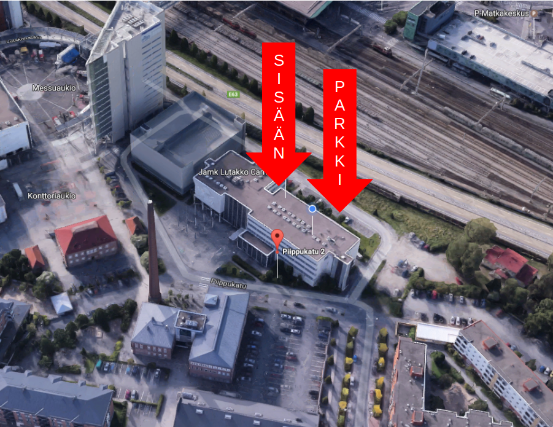

## Tervetuloa WIMMA labin avoimien ovien tapahtumaan!

Olemme käynnistäneet WIMMA labin kesän 2017 ajaksi JAMKin Dynamon IT-instituutissa!

* Perjantaina 9.6.2017 alkaen klo 10:00 - 11:30
* Piippukatu 2, 4. krs luokkaan D404-405
* Kannattaa ilmoittautua (yhteystiedot alhaalla)! Saatat saada kahvia ja pullaa
* [Google Map](https://www.google.fi/maps/place/Jyv%C3%A4skyl%C3%A4n+Ammattikorkeakoulu+Oy/@62.2416303,25.7598717,18.75z/data=!4m5!3m4!1s0x0000000000000000:0x75aa55a81cd7c009!8m2!3d62.2416224!4d25.7597309?hl=en)

# Agenda

* 9:45 -> Kahvit & nakerrettavaa...  
Tarkentuu vielä..
<!--
* 9:45 -> Kahvit & nakerrettavaa...
* 10:00 JAMK's Challenge Factory 2017 -toiminnan esittely
* 10:15 Mitä ovat kesän tavoitteet ja haasteet
* 10:30 Opiskelijat kertovat eri haasteista, joita he ovat työstäneet ensimmäisen "sprintin" ajan
* 10:45 Demotaan jo toimivia ratkaisuja
* Avointa keskustelua ja verkostoitumista
-->

## Miksi tulisin, tai edes vaivautuisin?

* Onko sinulla pulaa osaajista? ---> Ilmesty paikalle!
* Jos alempana olevat eri "käsitteet" herättävät aivolohkoissasi kiinnostusta --> Ilmesty paikalle!
* Read My lips! tämä on käsky!

* Peliohjelmointi
* Rancher, Docker, Micro Services, Cassandra, Hadoop
* SDN (Software defined networks)
* IOT, Rasberry PI, Open Stack,
* AI, konenäkö, koneoppiminen
* Data-analyysi

## Linkkejä:

* Mikä on [Challenge Factory?](info-challenge-factory)

## Näillä ohjeilla perille

Osoite on Piippukatu 2, 40100 Jyväskylä
D404-D405, 4. kerros.

Lisätietoa:  
Marko Rintamäki  
0504071047  
WIMMA Lab valmentaja  

Lauri Mäkinen  
0505271362  
WIMMA Lab valmentaja  

## Ilmoittautuminen:

Sähköposti:  
marko.rintamaki@jamk.fi  
lauri.makinen@jamk.fi
