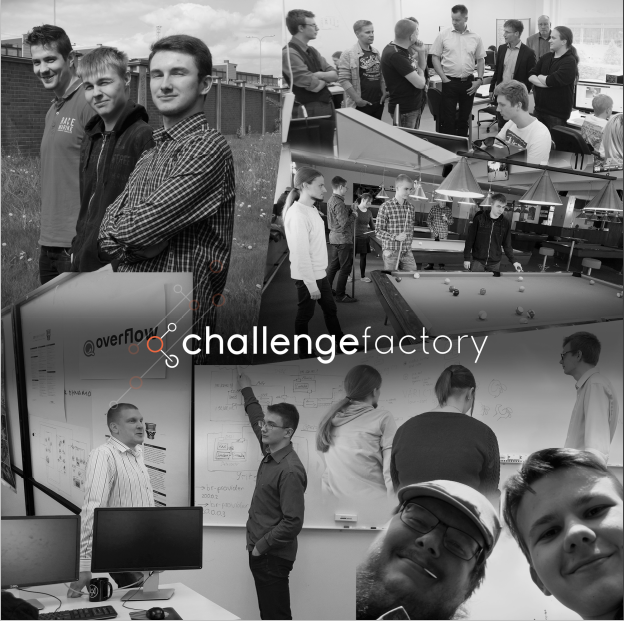

# Rekrytointi kannattaa aloittaa ajoissa... Luo hyvät kontaktit tuleviin mestareihin!

### Hakeeko yrityksesi uusia ohjelmisto-, verkko-, mediatekniikan tai kyberturvallisuuden tekijöitä?  

#### Challenge Factory tarjoaa yrityksellesi paraatipaikan verkostoitua ja rekrytoida huippuopiskelijoita rennon epävirallisissa tunnelmissa.

## Mikä tekee Challenge Factory tiimistä erityisen?

Eli toisin sanoen, miksi sinun yrityksesi tulee olla hyvin edustettuna juuri tälle opiskelijajoukolla?
* Challenge Factorylla on jo kuuden vuoden perinteet ohjelmistotuotannon- ja projektityöskentelymallien sisäänajamisesta
  * tästä joukosta koulitaan kesän aikana yrityksellesi valmiita projektityöntekijöitä (viime kesän projektille Inssiforum 2017 myönsi [kunniamaininnan](http://laurimakinen.com/honorable-mention-challenge-factory/))
  * Challenge Factory konseptia on kehitetty mm. [TIVIT Cloud Software Finland](https://www.youtube.com/watch?v=NLr-loPmI1c), [DIMECC Cyber Trust](http://cybertrust.fi/) ja [DIMECC N4S ](http://www.n4s.fi/en/) ohjelmissa
* Challenge Factoryn 27 opiskelijan tiimi on karsittu 45 hakijan joukosta
* Tämän kesän tiimistä nousee tulevaisuuden IoT, SDN ja AI asiantuntijoita

**Yritykselläsi on tilaisuus olla esillä seuraavissa tapahtumissa**

* 9.6.2017 Kettuketer tiimiytymispäivä (Yrityksesi saa mahdollisuuden esittäytyä ja osallistua illan tapahtumiin sekä tarjota ryhmälle esim. ruokailun ja pari olutta) Budjetti ~1000€

* 28.7.2017 Kaunailta (Yrityksesi pääsee isännöimään projektinlopetus saunailtaa koko porukalle ja tarjoaa esim. Pizza + olut +saunan) Budjetti ~2000€

* [Täältä löytyvät tarkemmat kuvaukset tapahtumista](info-kesatapahtumat)

**Vinkki: Yhdistäkää voimianne! Konsortiot ovat aina tervetulleita!**

  
Viime vuoden Kaunaillan isäntänä toimi Digia. Kuvassa olevista opiskelijoista suurin osa on jo kiinni työ-elämässä

# Ota siis yhteyttä ja onnistu opiskelijarekrytoinnissa!

__Marko Rintamäki__  
WIMMA Lab valmentaja  
0504071047  
marko.rintamaki@jamk.fi  

__Lauri Mäkinen__  
WIMMA Lab valmentaja  
0505271362  
lauri.makinen@jamk.fi  
